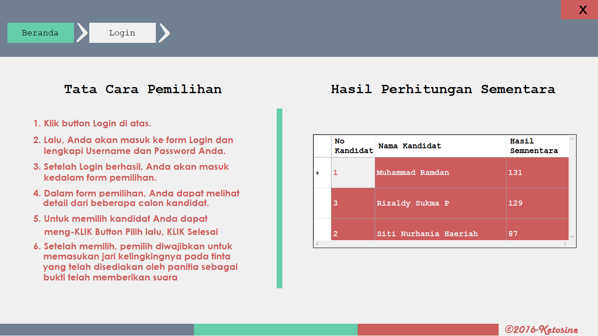
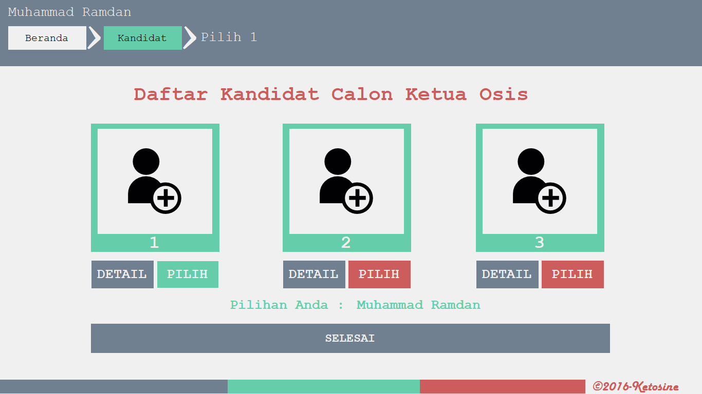
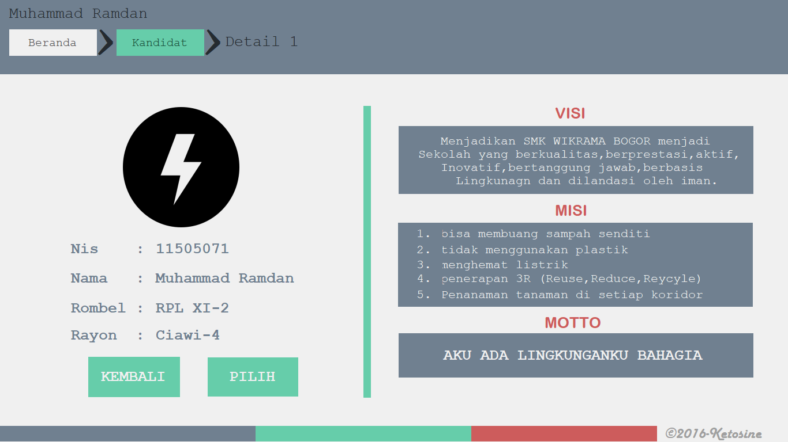

# Aplikasi Pemilihan Ketua Osis
Sebuah aplikasi berbasis desktop untuk pemilihan ketua osis pada sekolah.

## Fitur
* Dasboard

* Daftar Kandidat

* Detail Kandidat


## Teknologi
* Visual Basic
* Microsoft Access

## Info Developer
Jika ada pertanyaan bisa hubungi kontak dibawah : 
* [Email](mailto:programzidun@gmail.com) - programzidun@gmail.com
* [LinkedIn](https://www.linkedin.com/in/ramdanzidun/) - Muhammad Ramdan
* [Instagram](https://www.instagram.com/ramdanzidun/) - @ramdanzidun


```
Ku Coding Kau dengan Bismillah
```

